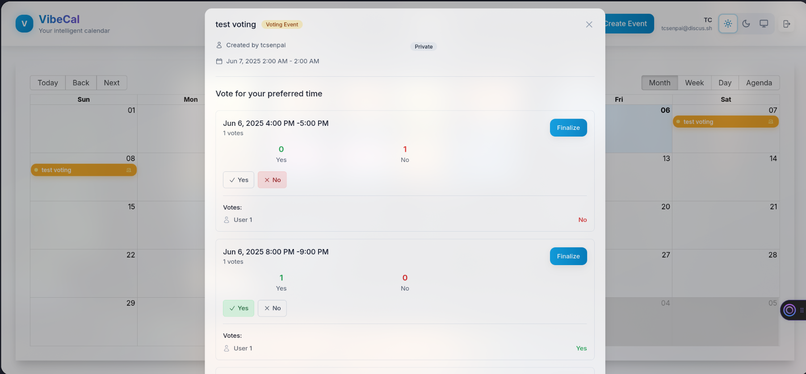

# VibeCal - Self-Hosted Calendar with Voting Events

A modern, self-hostable calendar web application with a unique voting events feature that allows users to vote on preferred times for events.



## Features

### Core Calendar Features
- **Multi-user calendar** - Google Calendar-like interface
- **Right-click context menu** - Quick event creation and management
- **Event management** - Create, view, and manage regular events
- **User authentication** - Secure registration and login system
- **Real-time updates** - Live updates using WebSocket connections
- **Public/private events** - Control event visibility
- **Different event types** - Visual distinction between regular and voting events

### Voting Events (Special Feature)
- **Time slot voting** - Users can vote on preferred time slots
- **Guest voting** - Allow non-registered users to vote via email
- **Multiple vote types** - Yes, No, and Maybe options
- **Real-time vote updates** - See votes as they come in
- **Event finalization** - Convert voting events to regular events
- **Voting deadlines** - Set time limits for voting

## Tech Stack

### Backend
- **Node.js** with TypeScript
- **Express.js** for REST API
- **PostgreSQL** for database
- **Socket.io** for real-time updates
- **JWT** for authentication
- **bcrypt** for password hashing

### Frontend
- **Next.js 14** with TypeScript
- **React** with hooks
- **Tailwind CSS** for styling
- **React Big Calendar** for calendar component
- **Zustand** for state management
- **React Query** for data fetching
- **React Hook Form** for form handling

### Deployment
- **Docker & Docker Compose** for containerization
- **PostgreSQL** in Docker container
- Self-hostable on any server with Docker support

## Quick Start

### Prerequisites
- Docker and Docker Compose
- Node.js 18+ (for development)

### Installation

1. **Clone the repository:**
   ```bash
   git clone <repository-url>
   cd vibecal
   ```

2. **Set up environment variables:**
   ```bash
   cp .env.example .env
   # Edit .env with your configuration
   ```

3. **Install dependencies (for development):**
   ```bash
   npm run setup
   ```

4. **Start with Docker Compose:**
   ```bash
   docker-compose up -d
   ```

5. **Access the application:**
   - Frontend: http://localhost:3000
   - Backend API: http://localhost:5000
   - Database: localhost:5432

### Development Mode

For development with hot reloading:

```bash
# Terminal 1 - Start database
docker-compose up postgres -d

# Terminal 2 - Start backend
cd backend
npm install
npm run dev

# Terminal 3 - Start frontend  
cd frontend
npm install
npm run dev
```

## Configuration

### Environment Variables

Create a `.env` file in the root directory:

```env
# Database
DB_PASSWORD=your_secure_password

# JWT Secret (change this!)
JWT_SECRET=your-super-secret-jwt-key

# URLs
FRONTEND_URL=http://localhost:3000
NEXT_PUBLIC_API_URL=http://localhost:5000
```

### Database Setup

The database schema is automatically initialized when using Docker Compose. For manual setup:

```bash
psql -U postgres -d vibecal -f backend/src/models/database.sql
```

## Usage

### Creating Regular Events
1. **Quick creation via right-click:** Right-click any empty time slot and select "Create Event"
2. **Button creation:** Click "New Event" in the calendar interface
3. Fill in event details (title, description, time, location)
4. Set visibility (public/private)
5. Save the event

### Creating Voting Events
1. **Quick creation via right-click:** Right-click any empty time slot and select "🗳️ Create Voting Event"
2. **Button creation:** Click "New Event" and select "🗳️ Voting Event"
3. **Add Time Slot Options:**
   - Use the prominent time slots interface to add multiple options
   - Each option needs a start and end time
   - Use "Quick Add" buttons for common scenarios:
     - "Next 3 afternoons" - adds 2PM slots for the next 3 days
     - "Weekday mornings" - adds 10AM slots for the next 5 weekdays
   - You can add up to 10 different time options
4. **Configure Voting Settings:**
   - **Guest voting:** Allow people without accounts to vote
   - **Maybe votes:** Enable "maybe" option in addition to yes/no
   - **Voting deadline:** Set when voting should end (optional)
5. The voting event appears in orange on the calendar

### Managing Existing Events

**Right-click any event** to access:
- **View Event** - See full event details and voting interface
- **Edit Event** - Modify event details
- **Delete Event** - Remove the event permanently

### How Voting Works
1. **Participants access the event:** Either through the calendar or a direct voting link
2. **Vote on each time slot:** 
   - ✅ **Yes** - Can attend at this time
   - ❌ **No** - Cannot attend at this time  
   - ❓ **Maybe** - Might be able to attend (if enabled)
3. **Real-time updates:** Vote counts update immediately for all participants
4. **See who voted:** View which users voted for each option
5. **Finalize the event:** Creator can select the winning time slot and convert to a regular event

### Guest Voting Experience
When guest voting is enabled:
1. **No account needed:** Guests can vote without creating an account
2. **Simple form:** Enter name and email to vote
3. **Direct voting links:** Event creators can generate special links like:
   ```
   https://your-domain.com/vote/123?token=abc123
   ```
4. **Anonymous or identified:** Guests can vote with their name or anonymously

### Voting Event vs Regular Event
| Feature | Regular Event | Voting Event |
|---------|---------------|--------------|
| **Time setting** | Set specific date/time | Propose multiple time options |
| **Participation** | Invite/accept model | Vote on preferred times |
| **Flexibility** | Fixed schedule | Democratic time selection |
| **Guest access** | Requires account | Optional guest voting |
| **Finalization** | Ready to use | Requires time selection |

## API Documentation

### Authentication Endpoints
- `POST /api/auth/register` - User registration
- `POST /api/auth/login` - User login
- `GET /api/auth/profile` - Get user profile

### Event Endpoints
- `GET /api/events` - Get user's events
- `POST /api/events` - Create new event
- `GET /api/events/:id` - Get event details
- `POST /api/events/:id/vote` - Submit vote
- `POST /api/events/:eventId/time-slots` - Add time slot
- `POST /api/events/:eventId/finalize` - Finalize voting event

## Deployment

### Local Development (Localhost)

Follow the Quick Start instructions above for local development on `localhost:3000`.

### Production Deployment on VPS

#### Option 1: Single Domain with Path-based Routing (Recommended)

This setup serves both frontend and API from the same domain using different paths.

1. **Server Requirements:**
   - Ubuntu 20.04+ or similar Linux distribution
   - Docker and Docker Compose installed
   - Domain name pointing to your VPS
   - At least 1GB RAM and 20GB storage

2. **Install Docker on Ubuntu:**
   ```bash
   # Update system
   sudo apt update && sudo apt upgrade -y
   
   # Install Docker
   curl -fsSL https://get.docker.com -o get-docker.sh
   sudo sh get-docker.sh
   sudo usermod -aG docker $USER
   
   # Install Docker Compose
   sudo curl -L "https://github.com/docker/compose/releases/latest/download/docker-compose-$(uname -s)-$(uname -m)" -o /usr/local/bin/docker-compose
   sudo chmod +x /usr/local/bin/docker-compose
   
   # Logout and login to refresh group membership
   ```

3. **Clone and configure the application:**
   ```bash
   git clone <repository-url>
   cd vibecal
   
   # Create production environment file
   cp .env.example .env
   ```

4. **Configure environment variables for production:**
   ```env
   # Update .env file with your domain
   FRONTEND_URL=https://your-domain.com
   NEXT_PUBLIC_API_URL=https://your-domain.com/api
   JWT_SECRET=your-super-secret-production-jwt-key-change-this
   DB_PASSWORD=your-secure-database-password
   
   # Optional: Email configuration for notifications
   SMTP_HOST=smtp.gmail.com
   SMTP_PORT=587
   SMTP_USER=your-email@gmail.com
   SMTP_PASS=your-app-password
   ```

5. **Install and configure Nginx:**
   ```bash
   sudo apt install nginx certbot python3-certbot-nginx -y
   
   # Create nginx configuration
   sudo nano /etc/nginx/sites-available/vibecal
   ```

6. **Nginx configuration for single domain:**
   ```nginx
   server {
       listen 80;
       server_name your-domain.com;
       
       # Redirect HTTP to HTTPS
       return 301 https://$server_name$request_uri;
   }
   
   server {
       listen 443 ssl http2;
       server_name your-domain.com;
       
       # SSL certificates (will be added by certbot)
       ssl_certificate /etc/letsencrypt/live/your-domain.com/fullchain.pem;
       ssl_certificate_key /etc/letsencrypt/live/your-domain.com/privkey.pem;
       
       # Security headers
       add_header X-Frame-Options DENY;
       add_header X-Content-Type-Options nosniff;
       add_header X-XSS-Protection "1; mode=block";
       add_header Strict-Transport-Security "max-age=31536000; includeSubDomains" always;
       
       # API routes
       location /api/ {
           proxy_pass http://localhost:5000/api/;
           proxy_set_header Host $host;
           proxy_set_header X-Real-IP $remote_addr;
           proxy_set_header X-Forwarded-For $proxy_add_x_forwarded_for;
           proxy_set_header X-Forwarded-Proto $scheme;
           
           # WebSocket support
           proxy_http_version 1.1;
           proxy_set_header Upgrade $http_upgrade;
           proxy_set_header Connection "upgrade";
       }
       
       # Socket.io for real-time updates
       location /socket.io/ {
           proxy_pass http://localhost:5000/socket.io/;
           proxy_set_header Host $host;
           proxy_set_header X-Real-IP $remote_addr;
           proxy_set_header X-Forwarded-For $proxy_add_x_forwarded_for;
           proxy_set_header X-Forwarded-Proto $scheme;
           
           # WebSocket support
           proxy_http_version 1.1;
           proxy_set_header Upgrade $http_upgrade;
           proxy_set_header Connection "upgrade";
       }
       
       # WebCal feeds (calendar subscriptions)
       location /webcal/ {
           proxy_pass http://localhost:5000/webcal/;
           proxy_set_header Host $host;
           proxy_set_header X-Real-IP $remote_addr;
           proxy_set_header X-Forwarded-For $proxy_add_x_forwarded_for;
           proxy_set_header X-Forwarded-Proto $scheme;
       }
       
       # Frontend application
       location / {
           proxy_pass http://localhost:3000;
           proxy_set_header Host $host;
           proxy_set_header X-Real-IP $remote_addr;
           proxy_set_header X-Forwarded-For $proxy_add_x_forwarded_for;
           proxy_set_header X-Forwarded-Proto $scheme;
       }
       
       # Optional: Basic rate limiting
       limit_req_zone $binary_remote_addr zone=api:10m rate=10r/s;
       location /api/auth/ {
           limit_req zone=api burst=5 nodelay;
           proxy_pass http://localhost:5000/api/auth/;
       }
   }
   ```

7. **Enable the site and get SSL certificate:**
   ```bash
   # Enable the site
   sudo ln -s /etc/nginx/sites-available/vibecal /etc/nginx/sites-enabled/
   sudo nginx -t  # Test configuration
   sudo systemctl reload nginx
   
   # Get SSL certificate from Let's Encrypt
   sudo certbot --nginx -d your-domain.com
   
   # Set up automatic renewal
   sudo crontab -e
   # Add this line:
   0 12 * * * /usr/bin/certbot renew --quiet
   ```

8. **Deploy the application:**
   ```bash
   # Build and start containers
   docker-compose up -d --build
   
   # Check status
   docker-compose ps
   docker-compose logs -f
   ```

#### Option 2: Subdomain Setup (Alternative)

If you prefer separate subdomains for frontend and API:

1. **DNS Configuration:**
   - Point `your-domain.com` to your VPS IP
   - Point `api.your-domain.com` to your VPS IP

2. **Update environment variables:**
   ```env
   FRONTEND_URL=https://your-domain.com
   NEXT_PUBLIC_API_URL=https://api.your-domain.com
   ```

3. **Nginx configuration for subdomains:**
   ```nginx
   # Frontend
   server {
       listen 443 ssl http2;
       server_name your-domain.com;
       
       location / {
           proxy_pass http://localhost:3000;
           proxy_set_header Host $host;
           proxy_set_header X-Real-IP $remote_addr;
           proxy_set_header X-Forwarded-For $proxy_add_x_forwarded_for;
           proxy_set_header X-Forwarded-Proto $scheme;
       }
   }
   
   # API
   server {
       listen 443 ssl http2;
       server_name api.your-domain.com;
       
       location / {
           proxy_pass http://localhost:5000;
           proxy_set_header Host $host;
           proxy_set_header X-Real-IP $remote_addr;
           proxy_set_header X-Forwarded-For $proxy_add_x_forwarded_for;
           proxy_set_header X-Forwarded-Proto $scheme;
           
           # WebSocket support
           proxy_http_version 1.1;
           proxy_set_header Upgrade $http_upgrade;
           proxy_set_header Connection "upgrade";
       }
   }
   ```

4. **Get SSL certificates for both domains:**
   ```bash
   sudo certbot --nginx -d your-domain.com -d api.your-domain.com
   ```

#### Option 3: Cloudflare Tunnel (Zero Trust)

For advanced users who want to avoid exposing ports directly:

1. **Install cloudflared:**
   ```bash
   wget -q https://github.com/cloudflare/cloudflared/releases/latest/download/cloudflared-linux-amd64.deb
   sudo dpkg -i cloudflared-linux-amd64.deb
   ```

2. **Configure tunnel:**
   ```bash
   cloudflared tunnel login
   cloudflared tunnel create vibecal
   ```

3. **Create tunnel config:**
   ```yaml
   # ~/.cloudflared/config.yml
   tunnel: your-tunnel-id
   credentials-file: ~/.cloudflared/your-tunnel-id.json
   
   ingress:
     - hostname: your-domain.com
       service: http://localhost:3000
     - hostname: api.your-domain.com
       service: http://localhost:5000
     - service: http_status:404
   ```

#### Maintenance and Monitoring

1. **Application Updates:**
   ```bash
   # Pull latest code
   git pull origin main
   
   # Rebuild and restart
   docker-compose down
   docker-compose up -d --build
   ```

2. **Monitor logs:**
   ```bash
   # Application logs
   docker-compose logs -f
   
   # Nginx logs
   sudo tail -f /var/log/nginx/access.log
   sudo tail -f /var/log/nginx/error.log
   ```

3. **Database backup automation:**
   ```bash
   # Create backup script
   sudo nano /opt/vibecal-backup.sh
   ```
   
   ```bash
   #!/bin/bash
   BACKUP_DIR="/opt/vibecal-backups"
   DATE=$(date +%Y%m%d_%H%M%S)
   
   mkdir -p $BACKUP_DIR
   docker exec vibecal-postgres-1 pg_dump -U postgres vibecal | gzip > $BACKUP_DIR/vibecal_$DATE.sql.gz
   
   # Keep only last 7 days of backups
   find $BACKUP_DIR -name "vibecal_*.sql.gz" -mtime +7 -delete
   ```
   
   ```bash
   sudo chmod +x /opt/vibecal-backup.sh
   
   # Add to crontab for daily backups at 2 AM
   sudo crontab -e
   # Add: 0 2 * * * /opt/vibecal-backup.sh
   ```

#### Firewall Configuration

```bash
# Install and configure UFW
sudo ufw enable
sudo ufw default deny incoming
sudo ufw default allow outgoing
sudo ufw allow ssh
sudo ufw allow 80/tcp
sudo ufw allow 443/tcp
sudo ufw reload
```

#### Troubleshooting Common Issues

1. **502 Bad Gateway:** Usually means containers aren't running
   ```bash
   docker-compose ps
   docker-compose up -d
   ```

2. **SSL Certificate Issues:**
   ```bash
   sudo certbot certificates
   sudo certbot renew --dry-run
   ```

3. **Database Connection Issues:**
   ```bash
   docker-compose logs postgres
   docker-compose restart postgres
   ```

4. **WebSocket Connection Issues:** Ensure your proxy configuration includes WebSocket support headers shown above.

### Backup and Restore

**Backup database:**
```bash
docker exec vibecal-postgres-1 pg_dump -U postgres vibecal > backup.sql
```

**Restore database:**
```bash
docker exec -i vibecal-postgres-1 psql -U postgres vibecal < backup.sql
```

## Contributing

1. Fork the repository
2. Create a feature branch
3. Make your changes
4. Add tests if applicable
5. Submit a pull request

## License

This project is open source and available under the [MIT License](LICENSE).

## Support

For issues and feature requests, please use the GitHub issues tracker.
